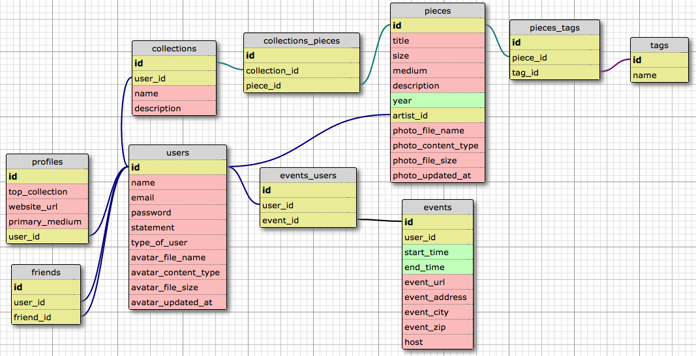

  

## Galleria Mia              

Born of frustration, Galleria Mia was inspired by a desire to have a simple mobile website where an Artist could showcase their works on a smartphone. We wanted intuitive and responsive controls, housed in a framework that skillfully presents the artworks without distracting from them.

You can visit Galleria Mia on Heroku here... http://galleriamia.herokuapp.com   New Friends and new Artists are always welcome. Please join!

### System Requirements 
* Ruby 2.2.1 p85
* Rails 4.2.4
* Postgres 9.4.4
* Internet access

#### External APIs and Libraries
* Google Maps  
* Bootstrap  
* Bootswatch  
* Materialize-sprockets  git 

### Getting Started 

Visit our Heroku site!  
Or, if you have appropriate access you can run the app locally:

1. Clone to local machine: 
      git clone https:/github.com/chi-cicadas-2015/galleriamia
2. Install dependencies: bundle
3. Initialize database: rake db:reset
4. Run server: rails s
5. Visit http://localhost:3000 

### Workflow  

Our workflow is laid out in CONTRIBUTING.md

### Database Schema  

### Crafted by

Code Artist | GitHub Profile
--- | ---
Maddie | https://github.com/madelynkasula  
Greg | https://github.com/gptasinski  
Nic | https://github.com/nilo916  
Paulo | https://github.com/pdgonzalez872  
David | https://github.com/cicadavid  